# Helix iOS App - High-Level Architecture

**Last Updated**: 2025-11-15  
**Version**: 1.0  
**Status**: Production

---

## Table of Contents

1. [System Overview](#system-overview)
2. [Architecture Diagrams](#architecture-diagrams)
3. [Component Details](#component-details)
4. [Data Flow](#data-flow)
5. [Technology Stack](#technology-stack)
6. [Design Patterns](#design-patterns)
7. [Security Architecture](#security-architecture)
8. [Performance Considerations](#performance-considerations)

---

## System Overview

Helix is a Flutter-based iOS companion app for Even Realities smart glasses that provides real-time conversation analysis through AI-powered transcription and insights.

### Key Capabilities

- **Real-time Audio Recording**: Capture conversations with high-quality audio
- **Speech Transcription**: Convert speech to text using Azure Whisper
- **AI Analysis**: Generate summaries, action items, and insights using custom LLM
- **Smart Glasses Integration**: Display results on Even Realities HUD via Bluetooth
- **Analytics & Tracking**: Monitor usage and feature adoption

---

## Architecture Diagrams

### 1. High-Level System Architecture

```mermaid
graph TB
    %% User & Devices
    User[👤 User]
    iPhone[📱 iPhone App]
    Glasses[🕶️ Even Realities Glasses]
    
    %% Frontend Layer
    subgraph "Frontend Layer"
        UI[UI Components<br/>Material Design 3]
        StateManager[State Management<br/>Riverpod]
        Navigation[Navigation<br/>Tab-based]
    end
    
    %% Core Services Layer
    subgraph "Core Services Layer"
        AudioService[Audio Service<br/>flutter_sound]
        TranscriptionService[Transcription Service<br/>speech_to_text + Whisper]
        LLMService[LLM Service<br/>Custom Endpoint]
        GlassesService[Glasses Manager<br/>Bluetooth]
        AnalyticsService[Analytics Service<br/>Tracking]
    end
    
    %% Data Layer
    subgraph "Data Layer"
        Models[Data Models<br/>Freezed]
        ConfigManager[Config Manager<br/>llm_config.local.json]
        DI[Dependency Injection<br/>get_it]
    end
    
    %% External Services
    subgraph "External Services"
        LLMEndpoint[LiteLLM API<br/>llm.art-ai.me]
        WhisperEndpoint[Azure Whisper<br/>OpenAI]
        RealtimeEndpoint[GPT-Realtime<br/>WebSocket]
    end
    
    %% Connections
    User -->|Interacts| iPhone
    iPhone <-->|Bluetooth LE| Glasses
    
    iPhone --> UI
    UI --> StateManager
    StateManager --> Navigation
    
    UI --> AudioService
    UI --> TranscriptionService
    UI --> LLMService
    UI --> GlassesService
    
    AudioService --> Models
    TranscriptionService --> Models
    LLMService --> Models
    
    Models --> DI
    ConfigManager --> DI
    
    TranscriptionService -->|HTTP POST| WhisperEndpoint
    LLMService -->|HTTP POST| LLMEndpoint
    LLMService -.->|WebSocket| RealtimeEndpoint
    
    AnalyticsService --> UI
    
    style iPhone fill:#e1f5ff
    style Glasses fill:#fff4e1
    style LLMEndpoint fill:#ffe1e1
    style WhisperEndpoint fill:#ffe1e1
```



### 2. Application Layer Architecture


### 3. Data Flow Architecture


### 4. Service Architecture


### 5. State Management Architecture


---

## Component Details

### Presentation Layer

#### 1. Main Screens

| Screen | Purpose | Key Features |
|--------|---------|--------------|
| **RecordingScreen** | Audio capture | Record button, waveform, timer |
| **TranscriptionScreen** | View transcripts | Scrollable text, edit capability |
| **AnalysisScreen** | AI insights | Summary, topics, action items |
| **GlassesScreen** | Device management | Pair, connect, battery status |
| **SettingsScreen** | Configuration | Model selection, API keys |

#### 2. Reusable Widgets

- `RecordingButton`: Animated record/stop button with state
- `WaveformVisualizer`: Real-time audio level display
- `ConversationBubble`: Chat-style message display
- `AnalysisCard`: Formatted analysis results
- `ModelSelector`: Dropdown for AI model selection

### Core Services Layer

#### 1. AudioService (`lib/core/audio/audio_service_impl.dart`)

**Responsibilities**:
- Initialize audio recorder
- Handle microphone permissions
- Capture audio at 16kHz, 16-bit, mono
- Monitor audio levels for waveform
- Save recordings to local storage

**Key Methods**:
```dart
Future<void> initialize()
Future<void> startRecording()
Future<void> stopRecording()
Stream<double> get audioLevels
Duration get recordingDuration
```

**Dependencies**:
- `flutter_sound`: Audio recording library
- `audio_session`: Audio session management
- `permission_handler`: Microphone permissions

#### 2. TranscriptionService (`lib/services/transcription/`)

**Responsibilities**:
- Coordinate native and cloud transcription
- Convert audio to text
- Provide confidence scores
- Support multiple languages

**Implementations**:
- `NativeTranscriptionService`: Uses iOS speech recognition
- `WhisperTranscriptionService`: Uses Azure OpenAI Whisper
- `TranscriptionCoordinator`: Switches between services

**Key Methods**:
```dart
Future<void> startTranscription({String? languageCode})
Future<void> stopTranscription()
void appendAudioData(Uint8List pcmData)
Stream<TranscriptSegment> get transcriptStream
```

#### 3. LLMService (`lib/services/implementations/llm_service_impl_v2.dart`)

**Responsibilities**:
- Send prompts to LLM API
- Parse responses
- Handle rate limiting
- Manage model selection

**Configuration**:
- Endpoint: `https://llm.art-ai.me/v1/chat/completions`
- Auth: Bearer token
- Models: 8 tiers (gpt-4.1-mini to gpt-5 to o3)

**Key Methods**:
```dart
Future<AnalysisResult> analyzeConversation(String text)
Future<String> summarize(String text)
Future<List<String>> extractActionItems(String text)
Future<Map<String, dynamic>> chat(String prompt)
```

#### 4. GlassesManager (`lib/ble_manager.dart`)

**Responsibilities**:
- Scan for Even Realities glasses
- Establish Bluetooth LE connection
- Send text/images to HUD
- Monitor battery level

**Key Methods**:
```dart
Future<void> scanForDevices()
Future<void> connect(String deviceId)
Future<void> sendToHUD(String text)
void disconnect()
```

#### 5. AnalyticsService (`lib/services/analytics_service.dart`)

**Responsibilities**:
- Track feature usage
- Log events
- Monitor errors
- Generate usage reports

**Events Tracked**:
- `recording_started`
- `recording_stopped`
- `transcription_completed`
- `analysis_requested`
- `glasses_connected`

---

## Data Flow

### Recording → Transcription → Analysis Flow

```
1. User Taps Record Button
   ↓
2. UI calls AudioService.startRecording()
   ↓
3. AudioService initializes flutter_sound recorder
   ↓
4. Every 100ms: AudioService emits audio level
   ↓
5. UI updates waveform visualization
   ↓
6. User Taps Stop Button
   ↓
7. UI calls AudioService.stopRecording()
   ↓
8. AudioService saves WAV file to storage
   ↓
9. UI receives audio file path
   ↓
10. UI calls TranscriptionService.transcribe(audioFile)
    ↓
11. TranscriptionService uploads to Whisper API
    ↓
12. Whisper API returns transcript JSON
    ↓
13. TranscriptionService parses and emits segments
    ↓
14. UI displays transcript
    ↓
15. User taps "Analyze" button
    ↓
16. UI calls LLMService.analyzeConversation(transcript)
    ↓
17. LLMService sends prompt to LLM API
    ↓
18. LLM API returns analysis JSON
    ↓
19. LLMService parses response
    ↓
20. UI displays summary, topics, action items
    ↓
21. UI sends results to GlassesManager
    ↓
22. GlassesManager renders on HUD
```

---

## Technology Stack

### Frontend

| Layer | Technology | Purpose |
|-------|------------|---------|
| **Framework** | Flutter 3.24+ | Cross-platform UI |
| **Language** | Dart 3.5+ | Application code |
| **State Management** | Riverpod 2.4+ | Reactive state |
| **Dependency Injection** | get_it 7.6+ | Service locator |
| **Immutable Models** | Freezed | Data classes |
| **Serialization** | json_annotation | JSON parsing |

### Audio Processing

| Component | Technology | Purpose |
|-----------|------------|---------|
| **Recording** | flutter_sound | Audio capture |
| **Session** | audio_session | Audio session mgmt |
| **Native STT** | speech_to_text | iOS speech recognition |
| **Permissions** | permission_handler | Microphone access |

### Networking

| Component | Technology | Purpose |
|-----------|------------|---------|
| **HTTP Client** | Dio 5.4+ | API calls |
| **REST API** | http | Simple requests |
| **WebSocket** | (Planned) | Real-time streaming |

### AI & ML

| Service | Provider | Model | Purpose |
|---------|----------|-------|---------|
| **LLM** | LiteLLM | gpt-4.1-mini to gpt-5 | Conversation analysis |
| **Reasoning** | LiteLLM | o1, o3 | Complex reasoning |
| **Transcription** | Azure OpenAI | Whisper | Speech-to-text |
| **Real-time** | Azure OpenAI | GPT-Realtime | Streaming (planned) |

### Smart Glasses

| Component | Technology | Purpose |
|-----------|------------|---------|
| **BLE** | flutter_bluetooth_serial | Bluetooth LE connection |
| **Glasses** | Even Realities G1 | AR display |

### Development Tools

| Tool | Purpose |
|------|---------|
| **Xcode** | iOS build and debugging |
| **Flutter DevTools** | Performance profiling |
| **Dart Analyzer** | Code quality |
| **fastlane** | CI/CD automation |

---

## Design Patterns

### 1. Clean Architecture

```
Presentation Layer (UI)
     ↓
Domain Layer (Business Logic)
     ↓
Data Layer (Models, Repositories)
     ↓
Infrastructure (Services, APIs)
```

**Benefits**:
- Separation of concerns
- Testability
- Maintainability
- Flexibility

### 2. Repository Pattern

```dart
// Abstract interface
abstract class TranscriptionRepository {
  Future<Transcript> transcribe(AudioFile file);
}

// Concrete implementations
class NativeTranscriptionRepository implements TranscriptionRepository {}
class WhisperTranscriptionRepository implements TranscriptionRepository {}
```

**Benefits**:
- Abstraction of data sources
- Easy testing with mocks
- Swappable implementations

### 3. Service Locator (Dependency Injection)

```dart
void setupServiceLocator() {
  GetIt.instance.registerSingleton<AudioService>(AudioServiceImpl());
  GetIt.instance.registerSingleton<LLMService>(LLMServiceImplV2());
}

// Usage
final audioService = GetIt.instance<AudioService>();
```

**Benefits**:
- Decoupled dependencies
- Single source of truth
- Testability

### 4. Provider Pattern (State Management)

```dart
final recordingProvider = StateNotifierProvider<RecordingNotifier, RecordingState>(
  (ref) => RecordingNotifier(ref.read(audioServiceProvider))
);

// Usage in widgets
Consumer(
  builder: (context, ref, child) {
    final recordingState = ref.watch(recordingProvider);
    return RecordButton(isRecording: recordingState.isRecording);
  }
)
```

**Benefits**:
- Reactive UI updates
- Scoped state
- Lazy initialization

### 5. Observer Pattern

```dart
class TranscriptionService {
  final _transcriptController = StreamController<TranscriptSegment>.broadcast();
  Stream<TranscriptSegment> get transcriptStream => _transcriptController.stream;
}

// Usage
transcriptionService.transcriptStream.listen((segment) {
  print('New transcript: ${segment.text}');
});
```

**Benefits**:
- Decoupled components
- Multiple listeners
- Event-driven architecture

---

## Security Architecture

### 1. API Key Management

```
llm_config.local.json (gitignored)
     ↓
AppConfig.load() at runtime
     ↓
Injected into services
     ↓
Sent as Bearer token
```

**Security Measures**:
- ✅ API keys never committed to git
- ✅ Template file without secrets
- ✅ Runtime loading only
- ✅ HTTPS-only communication

### 2. Data Privacy

**Local Storage**:
- Audio files stored temporarily
- Deleted after transcription (configurable)
- No persistent audio without consent

**Network Transmission**:
- TLS 1.2+ encryption
- No logging of sensitive data
- Minimal PII transmission

**User Consent**:
- Microphone permission required
- Analytics opt-in
- Clear privacy policy

### 3. Code Security

**Build Configuration**:
- Debug flags disabled in release
- Obfuscation enabled
- Certificate pinning (planned)

**Dependencies**:
- Regular security audits
- Only trusted packages
- Version pinning

---

## Performance Considerations

### 1. Memory Management

**Strategies**:
- Lazy loading of services
- Stream disposal in widgets
- Periodic memory cleanup
- Audio buffer optimization

**Targets**:
- Idle: <100MB RAM
- Active: <200MB RAM
- Peak: <300MB RAM

### 2. Battery Optimization

**Strategies**:
- Stop audio monitoring when idle
- Batch API requests
- Reduce Bluetooth polling
- Background task optimization

**Targets**:
- <10% battery/hour during active use
- <2% battery/hour during idle

### 3. Network Optimization

**Strategies**:
- Request compression (gzip)
- Connection pooling
- Retry with exponential backoff
- Offline mode support

**Targets**:
- <5s API response time
- <10s transcription time (10s audio)

### 4. UI Performance

**Strategies**:
- Widget tree optimization
- Const constructors
- RepaintBoundary for complex widgets
- Image caching

**Targets**:
- 60 FPS during normal use
- <100ms tap response time

---

## Scalability

### 1. Horizontal Scaling

**Current**:
- Single device/user focus

**Future**:
- Multi-device sync
- Cloud conversation storage
- User accounts

### 2. Vertical Scaling

**Optimizations**:
- On-device ML models (planned)
- Edge computing for transcription
- Reduced API calls

### 3. API Scaling

**Current Limits**:
- gpt-5: 2500 req/min
- o1: 1500 req/min
- gpt-4.1: 150 req/min

**Strategies**:
- Rate limit fallback
- Model tier switching
- Request queuing

---

## Deployment Architecture

```
Development
     ↓
Git Push
     ↓
CI/CD (GitHub Actions)
     ↓
Build & Test
     ↓
TestFlight (Beta)
     ↓
QA Validation
     ↓
App Store (Production)
```

---

## Monitoring & Observability

### 1. Logging

**Levels**:
- ERROR: Crashes, API failures
- WARN: Rate limits, degraded performance
- INFO: Feature usage, events
- DEBUG: Development only

**Tools**:
- Flutter Logger
- Xcode Console
- Crashlytics (planned)

### 2. Metrics

**Tracked**:
- API response times
- Transcription accuracy
- Error rates
- Feature adoption

**Tools**:
- Analytics Service
- App Store Connect

### 3. Crash Reporting

**Current**:
- Xcode Organizer
- TestFlight crash reports

**Planned**:
- Firebase Crashlytics
- Sentry integration

---

## Future Architecture Enhancements

### Short-term (Next 3 months)

1. **WebSocket Integration**
   - Real-time streaming with GPT-Realtime
   - Reduced latency

2. **On-device ML**
   - Local transcription with Core ML
   - Offline mode support

3. **Advanced Analytics**
   - Usage dashboards
   - Performance monitoring

### Long-term (Next 6-12 months)

1. **Multi-user Support**
   - User accounts
   - Cloud sync
   - Conversation history

2. **Advanced AI Features**
   - Speaker diarization
   - Sentiment analysis
   - Real-time fact-checking

3. **Platform Expansion**
   - Android support
   - Web dashboard
   - API for third-party apps

---

## Appendix

### A. Glossary

- **HUD**: Heads-Up Display (smart glasses screen)
- **STT**: Speech-To-Text
- **BLE**: Bluetooth Low Energy
- **DI**: Dependency Injection
- **LLM**: Large Language Model

### B. References

- [Flutter Architecture Guide](https://docs.flutter.dev/development/data-and-backend/state-mgmt/intro)
- [Clean Architecture](https://blog.cleancoder.com/uncle-bob/2012/08/13/the-clean-architecture.html)
- [Riverpod Documentation](https://riverpod.dev)
- [LiteLLM API Integration](./LITELLM_API_INTEGRATION.md)

---

**Document Version**: 1.0  
**Last Review**: 2025-11-15  
**Next Review**: 2025-12-15
