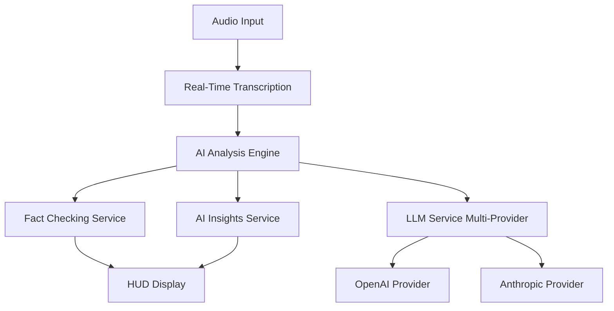

# Helix - AI-Powered Conversation Intelligence for Smart Glasses

[](https://flutter.dev)
[](https://dart.dev)
[](https://platform.openai.com)
[](LICENSE)

Helix is a Flutter-based companion app for Even Realities smart glasses that provides **real-time conversation analysis** and **AI-powered insights** displayed directly on the glasses HUD. The app processes live audio, performs speech-to-text conversion, and leverages advanced LLM APIs for fact-checking, summarization, and contextual assistance.

## ✨ Key Features

### 🎤 **Real-Time Audio Processing**
- High-quality audio capture (16kHz, mono)
- Voice activity detection and noise reduction
- Real-time waveform visualization
- Cross-platform audio support

### 🧠 **AI-Powered Analysis Engine**
- **Multi-Provider LLM Support**: OpenAI GPT-4 + Anthropic integration
- **Real-Time Fact Checking**: AI-powered claim detection and verification
- **Conversation Intelligence**: Action items, sentiment analysis, topic extraction
- **Smart Insights**: Contextual suggestions and recommendations
- **Automatic Failover**: Health monitoring with intelligent provider switching

### 📱 **Smart Glasses Integration**
- Bluetooth connectivity to Even Realities glasses
- Real-time HUD content rendering
- Battery monitoring and display control
- Gesture-based interaction support

### 🔒 **Privacy & Security**
- Local-first processing when possible
- Encrypted API communications
- Configurable data retention policies
- No persistent storage without explicit consent

## 🚀 Quick Start

### **Get Running in 2 Minutes**

```bash
# Clone and setup
git clone https://github.com/FJiangArthur/Helix-iOS.git
cd Helix-iOS
flutter pub get

# Generate code (Freezed models)
flutter packages pub run build_runner build --delete-conflicting-outputs

# Run the app
flutter run
```

### **Configure AI Features** (Optional)

Create `settings.local.json`:
```json
{
  "openai_api_key": "sk-your-openai-key",
  "anthropic_api_key": "sk-ant-your-anthropic-key"
}
```

> **🔑 New Developer?** See [QUICK_START.md](docs/QUICK_START.md) for complete setup guide.

## 🏗️ Architecture Overview

### **Epic 2.2: AI Analysis Engine** ✅ **COMPLETE**



### **Technology Stack**
- **Platform**: Flutter 3.24+ (Dart 3.5+)
- **State Management**: Riverpod + Freezed
- **Audio**: flutter_sound, audio_session
- **AI Integration**: OpenAI GPT-4, Anthropic
- **Hardware**: flutter_bluetooth_serial
- **DI**: get_it
- **Feature Flags**: Type-safe configuration-based feature toggles

### **Project Structure**
```
lib/
├── core/
│   ├── config/                # Configuration and feature flags
│   │   ├── feature_flag_models.dart    # Type-safe flag models
│   │   ├── feature_flag_service.dart   # Flag evaluation service
│   │   └── feature_flag_provider.dart  # Riverpod providers
│   └── utils/                 # Constants, logging, exceptions
├── models/                     # Freezed data models
├── services/                   # Business logic services
│   ├── ai_providers/          # OpenAI, Anthropic integrations
│   ├── implementations/       # Service implementations
│   ├── fact_checking_service.dart  # Real-time fact verification
│   ├── ai_insights_service.dart    # Conversation intelligence
│   └── llm_service.dart       # Multi-provider LLM interface
├── ui/                        # Flutter UI components
└── main.dart                  # App entry point
```

## 🧠 AI Services Showcase

### **Comprehensive Conversation Analysis**
```dart
final result = await llmService.analyzeConversation(
  'We need to meet next Friday to discuss the Q4 budget',
  type: AnalysisType.comprehensive,
);

// Get rich insights
print('Action Items: ${result.actionItems?.length}');
print('Sentiment: ${result.sentiment?.overallSentiment}');
print('Confidence: ${result.confidence}');
```

### **Real-Time Fact Checking**
```dart
factChecker.results.listen((fact) {
  switch (fact.status) {
    case FactCheckStatus.verified:
      showCheckmark(fact.claim);
    case FactCheckStatus.disputed:
      showWarning(fact.claim, fact.explanation);
  }
});

await factChecker.processText('The Earth revolves around the Sun');
```

### **AI Insights Generation**
```dart
insights.insights.listen((insight) {
  if (insight.category == InsightCategory.actionItem) {
    addToTaskList(insight.content, insight.metadata['assignee']);
  }
});
```

## 📚 Documentation

| Document | Description |
|----------|-------------|
| **[📖 Architecture](docs/Architecture.md)** | Complete system architecture and design patterns |
| **[🚀 Quick Start](docs/QUICK_START.md)** | Get up and running in 10 minutes |
| **[👩‍💻 Developer Guide](docs/DEVELOPER_GUIDE.md)** | Comprehensive development workflows and patterns |
| **[🔌 AI Services API](docs/AI_SERVICES_API.md)** | Complete API reference for AI services |
| **[🧪 Testing Strategy](docs/TESTING_STRATEGY.md)** | Testing approaches and best practices |
| **[🚩 Feature Flags](docs/dev/FEATURE_FLAGS.md)** | Complete feature flag system documentation |
| **[⚡ Feature Flags Quick Start](docs/dev/FEATURE_FLAGS_QUICK_START.md)** | Get started with feature flags in 2 minutes |

## 🛠️ Development

### **Prerequisites**
- Flutter SDK 3.24+
- VS Code or Android Studio
- OpenAI/Anthropic API keys (optional)

### **Development Commands**
```bash
# Run with hot reload
flutter run

# Generate code (after model changes)
flutter packages pub run build_runner build --delete-conflicting-outputs

# Run tests
flutter test

# Code analysis
flutter analyze

# Build for production
flutter build apk --release
```

### **Testing**
```bash
# Unit tests
flutter test test/unit/

# Integration tests  
flutter test test/integration/

# Widget tests
flutter test test/widget_test.dart

# Coverage report
flutter test --coverage
```

## 🎯 Current Status (Epic 2.2)

### **✅ Completed Features**
- ✅ **Multi-Provider LLM Service** - OpenAI + Anthropic with failover
- ✅ **Real-Time Fact Checking** - Claim detection and verification pipeline
- ✅ **AI Insights Engine** - Conversation intelligence and suggestions
- ✅ **Automatic Failover** - Health monitoring and provider switching
- ✅ **Comprehensive Testing** - Unit, integration, and widget tests
- ✅ **Production Architecture** - Scalable, maintainable codebase

### **🚀 Next Milestones**
- **Epic 2.3**: Smart Glasses UI Integration
- **Epic 2.4**: Real-Time Transcription Pipeline
- **Epic 3.0**: Production Polish & Optimization

## 🤝 Contributing

### **Development Workflow**
1. **Fork & Clone**: `git clone your-fork-url`
2. **Create Branch**: `git checkout -b feature/amazing-feature`
3. **Develop**: Follow patterns in [Developer Guide](docs/DEVELOPER_GUIDE.md)
4. **Test**: `flutter test` + `flutter analyze`
5. **Submit PR**: Include tests and documentation

### **Code Standards**
- Use Effective Dart guidelines
- Add ABOUTME comments to new files
- Maintain 90%+ test coverage
- Follow existing architecture patterns

### **PR Requirements**
- [ ] Tests pass (`flutter test`)
- [ ] Code analysis clean (`flutter analyze`)
- [ ] Documentation updated
- [ ] Breaking changes documented

## 📊 Performance Metrics

### **Real-Time Requirements**
- **Audio Latency**: <100ms capture to processing
- **AI Analysis**: <2 seconds for comprehensive analysis
- **Memory Usage**: <200MB sustained operation
- **UI Updates**: 60fps smooth rendering

### **AI Service Performance**
- **Provider Failover**: <5 second recovery
- **Fact Checking**: <3 seconds per claim
- **Insight Generation**: <1 second for basic insights
- **Caching Hit Rate**: >80% for repeated analysis

## 🔗 Useful Links

- **[Linear Project](https://linear.app/art-jiang/project/helix-real-time-transcription-and-fact-checking-4ac9c858372e)** - Issue tracking and roadmap
- **[GitHub Repository](https://github.com/FJiangArthur/Helix-iOS)** - Source code and releases
- **[Flutter Documentation](https://docs.flutter.dev)** - Flutter framework docs
- **[Riverpod Guide](https://riverpod.dev)** - State management documentation

## 📄 License

This project is licensed under the MIT License - see the [LICENSE](LICENSE) file for details.

---

**Built with ❤️ by the Helix Team**

*For questions, issues, or contributions, please reach out through GitHub Issues or our Linear project board.*