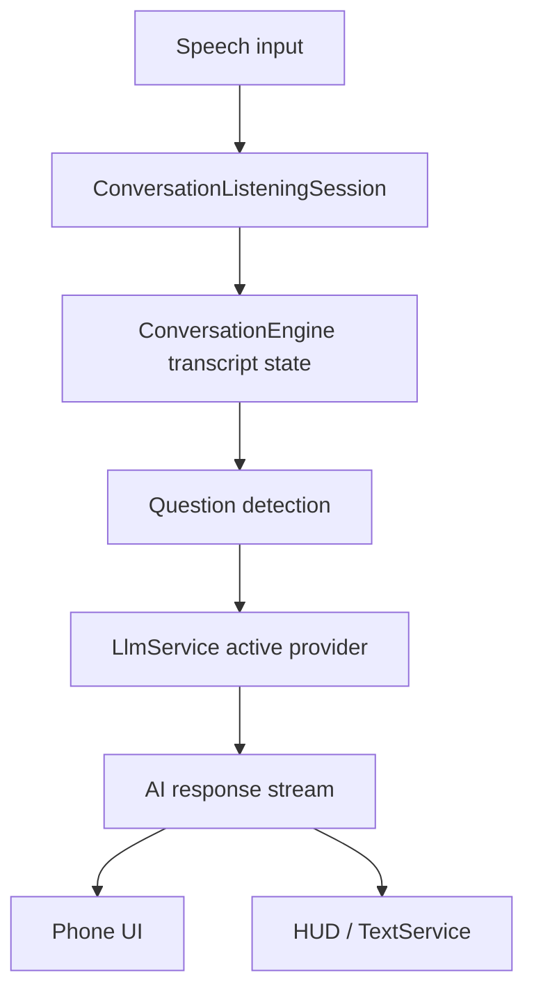
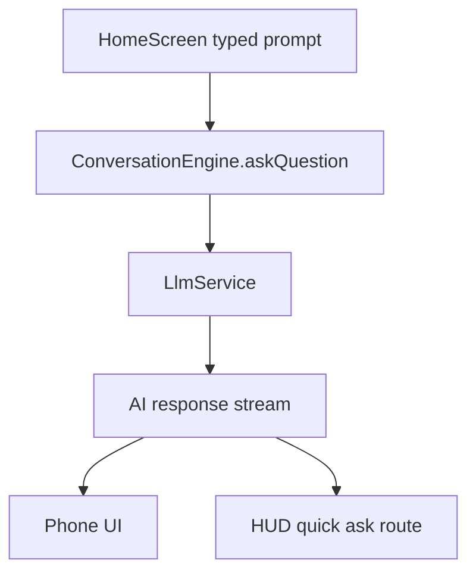
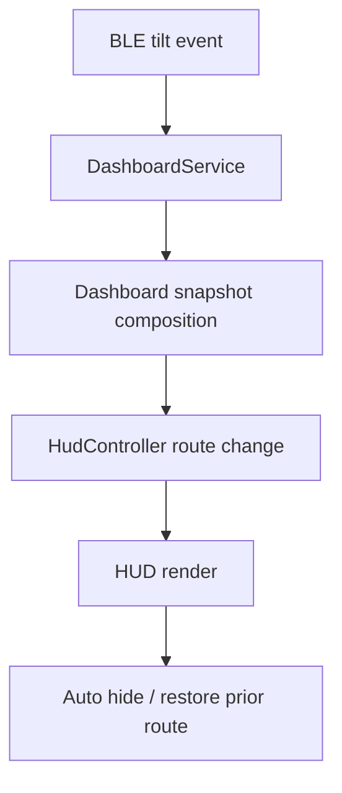

# Helix Onboarding Design Overview

This document explains the current Helix system design from the perspective of someone onboarding to maintain or extend the app.

## Purpose

Helix is not just a BLE utility and not just a chat app. It is a real-time orchestration layer between:

- live speech capture
- LLM reasoning
- local phone UI
- Even Realities G1 HUD output

The design favors direct singleton-based runtime wiring over a strict dependency injection architecture. That keeps the startup path small, but it means stateful services have to be understood as part of one connected runtime rather than isolated modules.

## System Design Goals

The current design optimizes for:

- low-latency assistance during live conversations
- flexible provider switching without rebuilding the app
- graceful degradation when glasses are disconnected
- a single operator workflow across phone and HUD
- local persistence for user preferences and session history

## Top-Level Components

### 1. App Shell

The app shell decides what the user sees and which long-lived singleton services are active.

Relevant files:

- `lib/main.dart`
- `lib/app.dart`

Responsibilities:

- boot settings
- boot BLE listeners
- configure LLM providers
- initialize dashboard listeners
- route between onboarding and the main tabbed application

### 2. Conversation Runtime

The conversation runtime is the heart of the assistant.

Relevant files:

- `lib/services/conversation_engine.dart`
- `lib/services/conversation_listening_session.dart`
- `lib/screens/home_screen.dart`

Responsibilities:

- accept partial and finalized transcript events
- maintain transcript snapshots
- detect questions
- generate answers with the active LLM provider
- stream responses to the phone UI
- coordinate HUD delivery and response lifecycle
- persist conversation turns

### 3. Provider Layer

The provider layer abstracts LLM vendors behind one runtime interface.

Relevant files:

- `lib/services/llm/llm_service.dart`
- provider implementations under `lib/services/llm/`

Responsibilities:

- register supported providers
- track active provider and model
- query available models
- issue chat or streaming requests
- expose provider-specific failures to higher layers

### 4. Glasses Runtime

The glasses runtime handles BLE state and HUD output routing.

Relevant files:

- `lib/ble_manager.dart`
- `lib/services/dashboard_service.dart`
- `lib/services/hud_controller.dart`
- `lib/services/text_service.dart`

Responsibilities:

- connect to G1 hardware
- stream text payloads to the HUD
- manage temporary dashboard overlays
- arbitrate display ownership between features

### 5. Native Speech Bridge

Speech capture crosses the Flutter/native boundary.

Relevant files:

- `ios/Runner/AppDelegate.swift`
- `ios/Runner/SpeechStreamRecognizer.swift`
- `ios/Runner/OpenAIRealtimeTranscriber.swift`

Responsibilities:

- own the iOS speech recognizer bridge
- manage microphone authorization
- emit speech events over Flutter event channels
- optionally use OpenAI realtime transcription in native code

## Design Flows

### Flow A: Spoken Question To HUD Answer

Observations:

- speech and answer generation are intentionally decoupled
- the engine is the central state owner
- the same answer stream can feed both phone and glasses

### Flow B: Typed Quick Ask

Observations:

- typed and spoken questions converge in the same response layer
- provider behavior should stay consistent across both entrypoints

### Flow C: Dashboard Trigger

Observations:

- dashboard display is temporary and route-sensitive
- the system must restore the previous HUD intent cleanly

## Why The Current Design Looks Like This

The codebase reflects iterative hardware-driven product development rather than a single top-down architecture pass.

That explains a few visible patterns:

- singleton services are common because they simplify wiring between Flutter, native code, and BLE callbacks
- some legacy flows still coexist with the current assistant pipeline
- screen code sometimes contains operational logic because features were validated in UI-first iterations

This is acceptable for the current stage, but it raises the bar for integration discipline.

## Current Architectural Constraints

### Shared Global State

Many services are singletons and depend on ambient runtime state.

Impact:

- easy to boot
- harder to reason about in parallel
- easier to introduce route/state coupling bugs

### Audio Session Contention

Live transcription and explicit recording both want control of the audio stack.

Impact:

- assistant listening and record-tab behavior must stay clearly separated
- eager initialization of recording services can break speech flows

### Xcode Project Drift

Native Swift files can exist on disk but still be absent from `Runner.xcodeproj`.

Impact:

- Flutter compiles may fail only when a native type is first referenced
- repo changes that touch native code should treat `project.pbxproj` as part of the source of truth

### Mixed Legacy And Active Paths

The repository contains older experiments alongside active runtime code.

Impact:

- file presence alone does not prove a codepath is live
- onboarding engineers should start from entrypoints and mounted screens, not from broad file counts

## Design Principles For Future Changes

When making changes, preserve these boundaries:

### Keep Session Lifecycle In `ConversationListeningSession`

Do not move speech transport or finalization logic into screens.

### Keep Conversation Policy In `ConversationEngine`

Question detection, response timing, response cancellation, follow-ups, and history persistence belong here.

### Keep Device Display Routing In HUD Services

Do not let screens write directly to glasses transport unless the feature is explicitly a hardware console tool.

### Keep User Defaults In `SettingsManager`

If behavior is user-configurable and persists across launches, it belongs in settings.

## Recommended Refactor Directions

These are the highest-value structural improvements if the team chooses to keep evolving the app:

1. Isolate active assistant runtime interfaces from legacy helper flows.
2. Reduce singleton coupling around HUD display ownership.
3. Introduce clearer contracts between speech transport and response generation.
4. Add a source-of-truth map for active native iOS files so project drift is caught earlier.

## Onboarding Summary

A new engineer should leave onboarding with these conclusions:

- `ConversationEngine` is the behavioral center of the assistant.
- `ConversationListeningSession` is the speech bridge coordinator.
- `BleManager`, `HudController`, and `DashboardService` own the glasses side.
- `SettingsManager` determines most runtime behavior before the first user action.
- Native iOS file membership in `Runner.xcodeproj` is operationally significant, not incidental.
