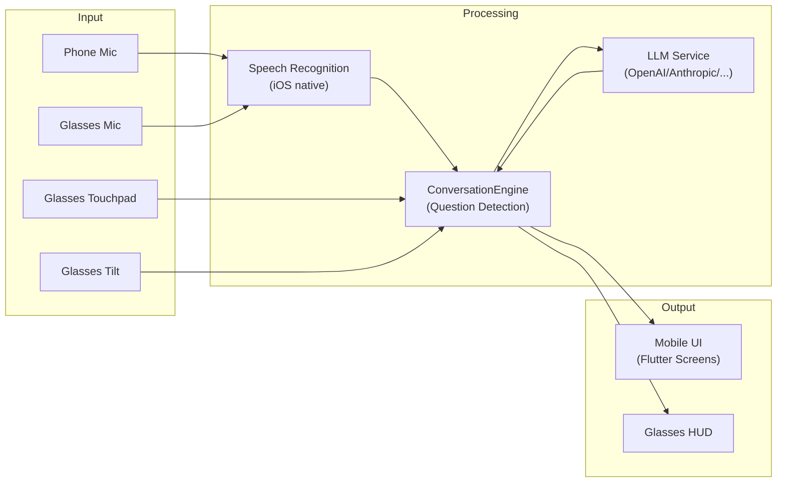
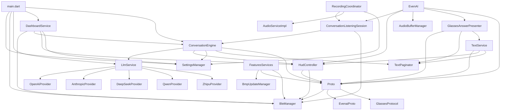

# Helix Architecture Diagram

## Full System Overview

```mermaid
graph TB
    subgraph External["☁ External APIs"]
        OpenAI["OpenAI API"]
        Anthropic["Anthropic API"]
        DeepSeek["DeepSeek API"]
        Qwen["Qwen API"]
        Zhipu["Zhipu API"]
    end

    subgraph Hardware["Even Realities G1 Glasses"]
        GlassesHW["G1 Hardware"]
        GlassesMic["Glasses Microphone"]
        GlassesHUD["HUD Display"]
        GlassesTouchpad["Touchpad L/R"]
        GlassesTilt["Tilt Sensor"]
    end

    subgraph Frontend["Frontend — Flutter UI Layer"]
        App["HelixApp / MainScreen"]
        HomeScreen["HomeScreen<br/>(Assistant Tab)"]
        G1TestScreen["G1TestScreen<br/>(Glasses Tab)"]
        HistoryScreen["ConversationHistoryScreen<br/>(History Tab)"]
        DetailScreen["DetailAnalysisScreen<br/>(Detail Tab)"]
        SettingsScreen["SettingsScreen<br/>(Settings Tab)"]
        OnboardingScreen["OnboardingScreen"]
        RecordingScreen["RecordingScreen"]
        FileManagementScreen["FileManagementScreen"]
        AIAssistantScreen["AIAssistantScreen"]
        EvenFeaturesScreen["EvenFeaturesScreen"]
        EvenAIHistoryScreen["EvenAIHistoryScreen"]

        subgraph FeaturePages["Feature Sub-Pages"]
            BmpPage["BmpPage"]
            TextPage["TextPage"]
            NotificationPage["Notification Pages"]
        end

        subgraph Widgets["Shared Widgets"]
            AnimatedText["AnimatedTextStream"]
            GlassCard["GlassCard"]
            GlowButton["GlowButton"]
            HomeModules["HomeAssistantModules"]
            StatusIndicator["StatusIndicator"]
        end

        Theme["HelixTheme"]
    end

    subgraph BLEService["BLE Service — Bluetooth Communication"]
        BleManager["BleManager<br/>(MethodChannel bridge)"]
        Proto["Proto<br/>(Command encoder)"]
        EvenaiProto["EvenaiProto<br/>(AI data packets)"]
        GlassesProtocol["GlassesProtocol<br/>(HUD state encoding)"]
        BleReceive["BleReceive<br/>(Response parser)"]
    end

    subgraph ConversationService["Conversation Intelligence Service"]
        ConversationEngine["ConversationEngine<br/>(Pipeline orchestrator)"]
        ConversationContext["ConversationContext<br/>(History & prompts)"]
        ListeningSession["ConversationListeningSession<br/>(Speech recognition)"]
        HandoffMemory["HandoffMemory<br/>(Text handoff tracking)"]
    end

    subgraph AudioService["Audio Service"]
        AudioInterface["AudioService<br/>(Interface)"]
        AudioImpl["AudioServiceImpl<br/>(flutter_sound)"]
        AudioBuffer["AudioBufferManager<br/>(Glasses audio buffer)"]
        RecordingCoord["RecordingCoordinator<br/>(Unified toggle)"]
    end

    subgraph LLMService["LLM Service — AI Provider Layer"]
        LlmService["LlmService<br/>(Provider manager)"]
        LlmProvider["LlmProvider<br/>(Interface)"]
        OpenAiProvider["OpenAiProvider"]
        AnthropicProvider["AnthropicProvider"]
        DeepSeekProvider["DeepSeekProvider"]
        QwenProvider["QwenProvider"]
        ZhipuProvider["ZhipuProvider"]
        OpenAiCompatible["OpenAiCompatibleProvider<br/>(Base class)"]
    end

    subgraph HUDService["HUD / Display Service"]
        HudController["HudController<br/>(Screen & intent router)"]
        HudIntent["HudIntent<br/>(idle/liveListening/quickAsk/...)"]
        AnswerPresenter["GlassesAnswerPresenter<br/>(Paginated delivery)"]
        TextPaginator["TextPaginator<br/>(Page layout engine)"]
        TextService["TextService<br/>(Text transfer)"]
    end

    subgraph DashboardSvc["Dashboard Service"]
        DashboardService["DashboardService<br/>(Tilt-triggered dashboard)"]
        DashboardSnapshot["DashboardSnapshot<br/>(Data model)"]
    end

    subgraph GlassesCoordinator["Glasses Coordinator"]
        EvenAI["EvenAI<br/>(Session coordinator)"]
        FeaturesServices["FeaturesServices<br/>(BMP updates)"]
        BmpUpdateManager["BmpUpdateManager"]
    end

    subgraph ConfigService["Settings & Config Service"]
        SettingsManager["SettingsManager<br/>(SharedPreferences + SecureStorage)"]
        ProviderErrorState["ProviderErrorState"]
    end

    subgraph Models["Data Models"]
        AudioConfig["AudioConfiguration"]
        AudioChunk["AudioChunk"]
        BleHealthMetrics["BleHealthMetrics"]
        BleTransaction["BleTransaction"]
        AssistantProfile["AssistantProfile"]
        AssistantSession["AssistantSessionMeta"]
        EvenaiModel["EvenaiModel"]
    end

    %% ── Frontend Navigation ──
    App --> HomeScreen
    App --> G1TestScreen
    App --> HistoryScreen
    App --> DetailScreen
    App --> SettingsScreen
    App -.-> OnboardingScreen

    %% ── Frontend → Services ──
    HomeScreen --> ConversationEngine
    HomeScreen --> RecordingCoord
    HomeScreen --> EvenAI
    HomeScreen --> HudController
    G1TestScreen --> BleManager
    G1TestScreen --> EvenAI
    G1TestScreen --> FeaturesServices
    HistoryScreen --> ConversationEngine
    DetailScreen --> ConversationEngine
    DetailScreen --> LlmService
    SettingsScreen --> SettingsManager
    SettingsScreen --> LlmService
    SettingsScreen --> BleManager
    RecordingScreen --> AudioInterface
    AIAssistantScreen --> LlmService
    EvenFeaturesScreen --> FeaturesServices
    TextPage --> TextService

    %% ── Conversation Intelligence ──
    ConversationEngine --> LlmService
    ConversationEngine --> HudController
    ConversationEngine --> Proto
    ConversationEngine --> SettingsManager
    ConversationEngine --> TextPaginator
    ConversationEngine --> ConversationContext
    ListeningSession --> ConversationEngine
    ListeningSession --> BleManager

    %% ── Audio Pipeline ──
    RecordingCoord --> ListeningSession
    RecordingCoord --> AudioImpl
    RecordingCoord --> SettingsManager
    AudioImpl -.-> AudioInterface

    %% ── EvenAI Coordinator ──
    EvenAI --> AudioBuffer
    EvenAI --> HudController
    EvenAI --> ListeningSession
    EvenAI --> ConversationEngine
    EvenAI --> AnswerPresenter
    EvenAI --> Proto

    %% ── HUD/Display ──
    HudController --> Proto
    HudController --> BleManager
    AnswerPresenter --> Proto
    AnswerPresenter --> TextPaginator
    AnswerPresenter --> TextService
    TextService --> Proto
    TextService --> TextPaginator
    TextService --> HudController

    %% ── BLE Layer ──
    BleManager --> Proto
    Proto --> EvenaiProto
    Proto --> GlassesProtocol
    BleManager <--> GlassesHW
    GlassesMic --> AudioBuffer
    GlassesHUD <-- Proto
    GlassesTouchpad --> EvenAI
    GlassesTilt --> DashboardService

    %% ── Dashboard ──
    DashboardService --> BleManager
    DashboardService --> ConversationEngine
    DashboardService --> HudController
    DashboardService --> Proto
    DashboardService --> SettingsManager

    %% ── LLM Providers ──
    LlmService --> LlmProvider
    OpenAiProvider -.-> LlmProvider
    AnthropicProvider -.-> LlmProvider
    DeepSeekProvider -.-> LlmProvider
    QwenProvider -.-> LlmProvider
    ZhipuProvider -.-> LlmProvider
    DeepSeekProvider --> OpenAiCompatible
    QwenProvider --> OpenAiCompatible
    ZhipuProvider --> OpenAiCompatible
    OpenAiProvider --> OpenAI
    AnthropicProvider --> Anthropic
    DeepSeekProvider --> DeepSeek
    QwenProvider --> Qwen
    ZhipuProvider --> Zhipu

    %% ── Features ──
    FeaturesServices --> BmpUpdateManager
    FeaturesServices --> Proto
    FeaturesServices --> BleManager

    %% ── Styling ──
    classDef frontend fill:#1a1a2e,stroke:#00d4ff,color:#fff
    classDef service fill:#16213e,stroke:#0f3460,color:#fff
    classDef external fill:#0f3460,stroke:#e94560,color:#fff
    classDef hardware fill:#533483,stroke:#e94560,color:#fff
    classDef model fill:#2a2a4a,stroke:#7f8c8d,color:#ccc

    class App,HomeScreen,G1TestScreen,HistoryScreen,DetailScreen,SettingsScreen,OnboardingScreen,RecordingScreen,FileManagementScreen,AIAssistantScreen,EvenFeaturesScreen,EvenAIHistoryScreen,BmpPage,TextPage,NotificationPage,AnimatedText,GlassCard,GlowButton,HomeModules,StatusIndicator,Theme frontend
    class BleManager,Proto,EvenaiProto,GlassesProtocol,BleReceive,ConversationEngine,ConversationContext,ListeningSession,HandoffMemory,AudioInterface,AudioImpl,AudioBuffer,RecordingCoord,LlmService,LlmProvider,OpenAiProvider,AnthropicProvider,DeepSeekProvider,QwenProvider,ZhipuProvider,OpenAiCompatible,HudController,HudIntent,AnswerPresenter,TextPaginator,TextService,DashboardService,DashboardSnapshot,EvenAI,FeaturesServices,BmpUpdateManager,SettingsManager,ProviderErrorState service
    class OpenAI,Anthropic,DeepSeek,Qwen,Zhipu external
    class GlassesHW,GlassesMic,GlassesHUD,GlassesTouchpad,GlassesTilt hardware
    class AudioConfig,AudioChunk,BleHealthMetrics,BleTransaction,AssistantProfile,AssistantSession,EvenaiModel model
```

## Simplified Data Flow

```mermaid
flowchart LR
    subgraph Input
        Phone["Phone Mic"]
        Glasses["Glasses Mic"]
        Touch["Glasses Touchpad"]
        Tilt["Glasses Tilt"]
    end

    subgraph Processing
        Speech["Speech Recognition<br/>(iOS native)"]
        Engine["ConversationEngine<br/>(Question Detection)"]
        LLM["LLM Service<br/>(OpenAI/Anthropic/...)"]
    end

    subgraph Output
        MobileUI["Mobile UI<br/>(Flutter Screens)"]
        GlassesHUD["Glasses HUD"]
    end

    Phone --> Speech
    Glasses --> Speech
    Speech --> Engine
    Engine --> LLM
    LLM --> Engine
    Engine --> MobileUI
    Engine --> GlassesHUD
    Touch --> Engine
    Tilt --> Engine
```

## Service Dependency Map

```mermaid
flowchart TD
    main["main.dart"] --> SettingsManager
    main --> BleManager
    main --> LlmService
    main --> DashboardService
    main --> ConversationEngine

    ConversationEngine --> LlmService
    ConversationEngine --> HudController
    ConversationEngine --> SettingsManager
    ConversationEngine --> TextPaginator
    ConversationEngine --> Proto

    EvenAI --> ConversationListeningSession
    EvenAI --> HudController
    EvenAI --> AudioBufferManager
    EvenAI --> GlassesAnswerPresenter
    EvenAI --> Proto

    DashboardService --> BleManager
    DashboardService --> ConversationEngine
    DashboardService --> HudController
    DashboardService --> SettingsManager

    RecordingCoordinator --> ConversationListeningSession
    RecordingCoordinator --> AudioServiceImpl
    RecordingCoordinator --> SettingsManager

    ConversationListeningSession --> ConversationEngine
    ConversationListeningSession --> BleManager

    HudController --> Proto
    HudController --> BleManager

    GlassesAnswerPresenter --> Proto
    GlassesAnswerPresenter --> TextPaginator
    GlassesAnswerPresenter --> TextService

    TextService --> Proto
    TextService --> HudController
    TextService --> TextPaginator

    LlmService --> OpenAiProvider
    LlmService --> AnthropicProvider
    LlmService --> DeepSeekProvider
    LlmService --> QwenProvider
    LlmService --> ZhipuProvider

    Proto --> BleManager
    Proto --> EvenaiProto
    Proto --> GlassesProtocol

    FeaturesServices --> BmpUpdateManager
    FeaturesServices --> Proto
    FeaturesServices --> BleManager
```
